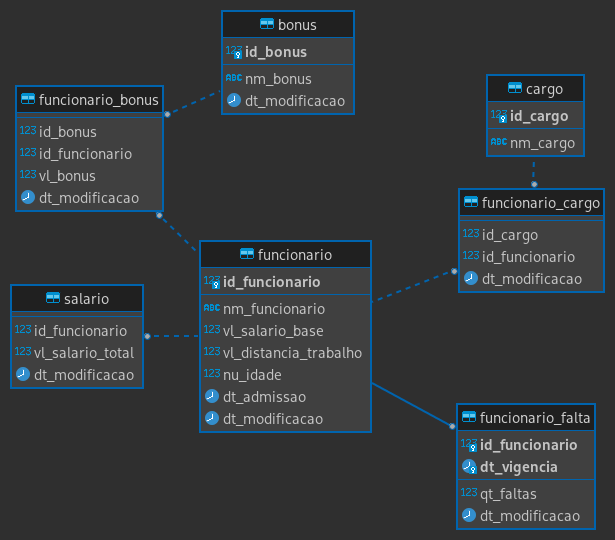
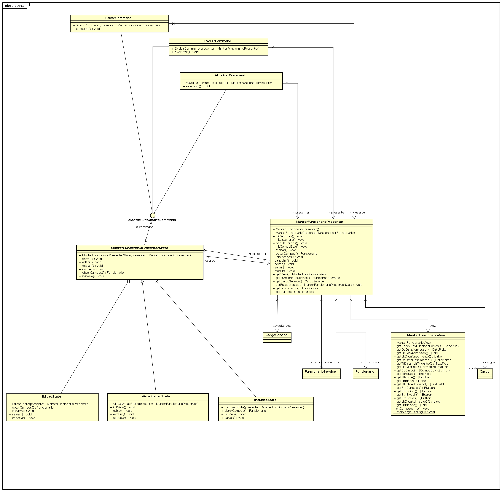
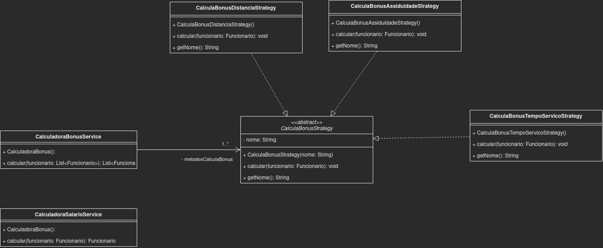
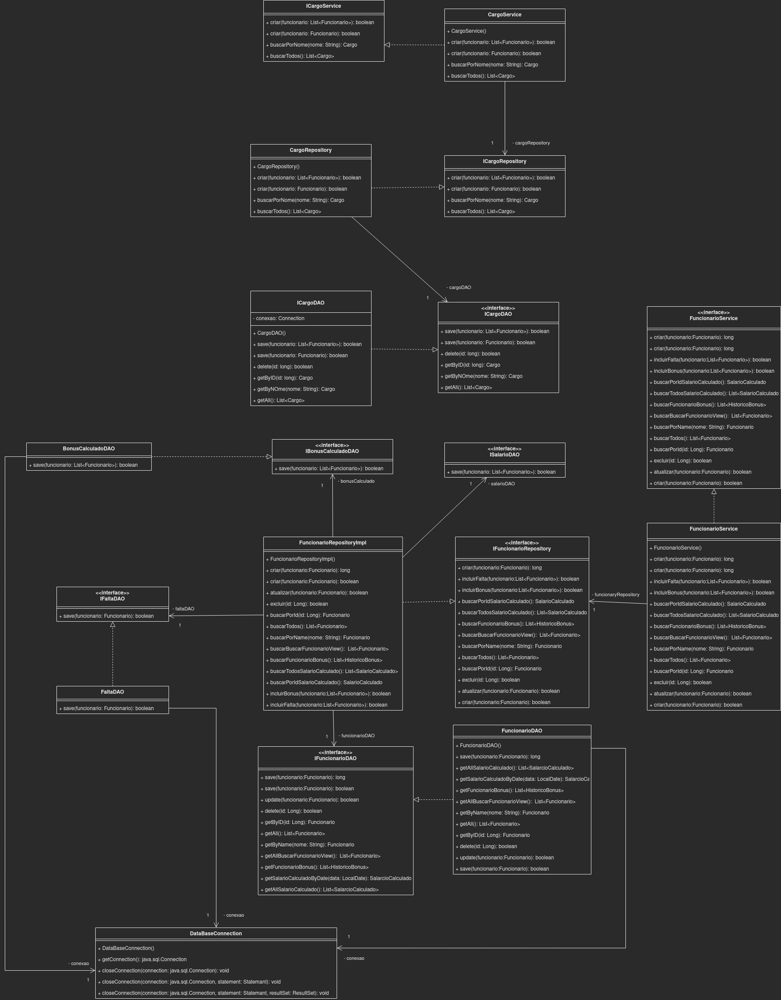
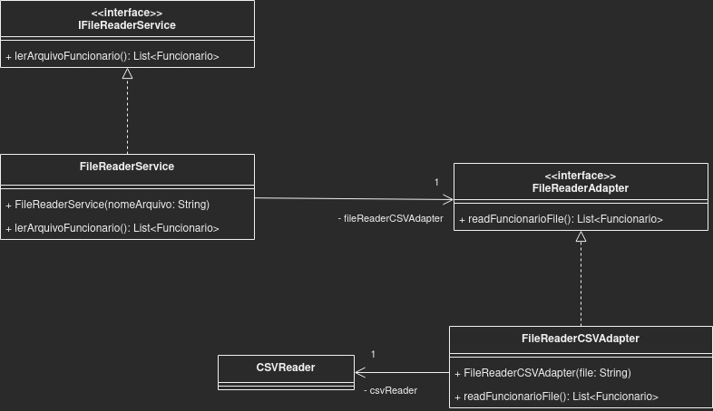

# Sistema de gestão de funcionários

## Trabalho da disciplina de Padrão de Projetos de Software

### Componentes:
- Eloy de Freitas Almeida
- Matheus Paulo Bastos

### Pré requisitos
- É necessário ter o docker instalado para utilizar o banco de dados.

```
https://docs.docker.com/desktop/
```
### Para iniciar o banco de dados siga o passo a passo:

- Execute no terminal o seguinte comando para entrar no diretório docker:

```
cd docker 
```
- Execute o seguinte comando para inicializar o container docker e criar as tabelas do banco de dados:

```
docker compose up -d
ou
docker-compose up -d
```

## Considerações:
- No diretório data existe o arquivo funcionario_reduzido.csv com uma quantidade pequena de registro para teste. 

- A insersão de funcionarios de um arquivo muito grande demora muito.

## Modelagem

### Modelo Entidade de Relacionamento



### Model

### ManterFuncionarioPresenter



### Modelo de domínio


### Calculadora Bonus service




### DAO




### File Reader




